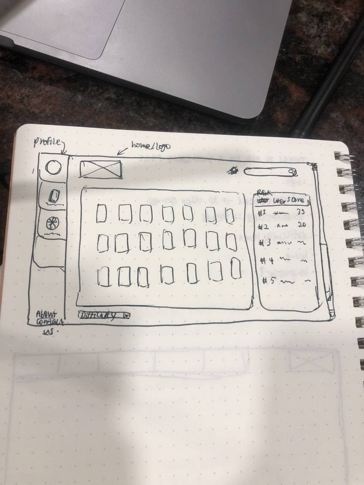
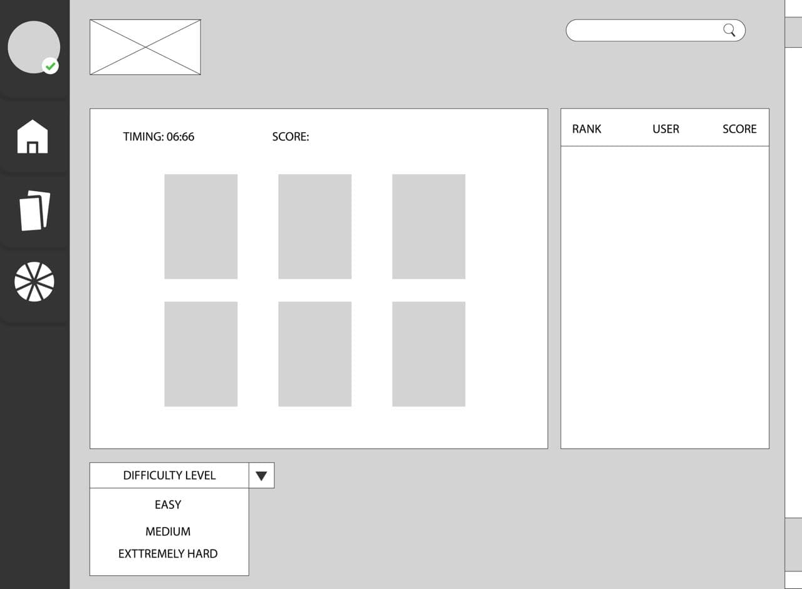
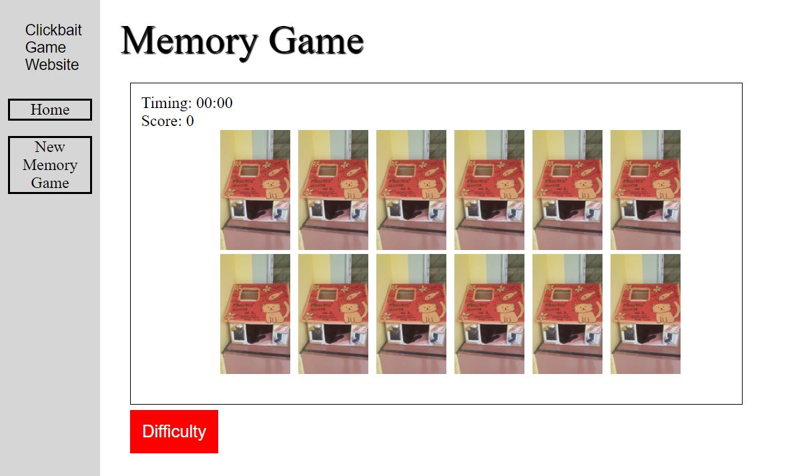

# expandable-gamesite
An expandable project that starts with a memory flip game

UI Designs done by [ZhiQing](https://www.linkedin.com/in/zhiqing-liew/):

Pencil Sketch:

Digital Sketch:

Current UI:

Features:

- [x] Timer
- [x] Scoring
- [ ] Difficulty
- [ ] User profile
- [ ] Ranking

